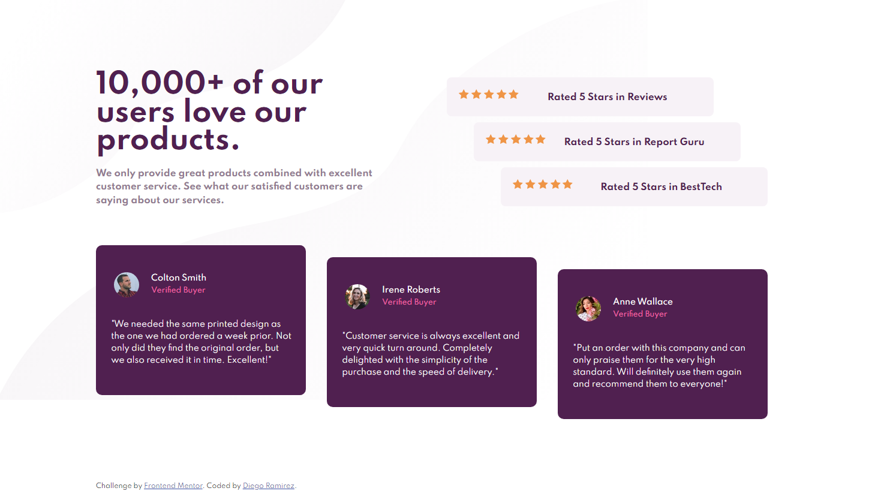
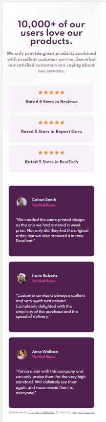

# Frontend Mentor - Social proof section solution

This is a solution to the [Social proof section challenge on Frontend Mentor](https://www.frontendmentor.io/challenges/social-proof-section-6e0qTv_bA). Frontend Mentor challenges help you improve your coding skills by building realistic projects. 

### The challenge

Users should be able to:

- View the optimal layout for the section depending on their device's screen size

### Screenshot

### Links

- Solution URL: [solution](https://www.frontendmentor.io/solutions/socialproofsectionmasterproject-DYE5YzB8l)
- Live Site URL: [Vercel](https://social-proof-section-master-three-xi.vercel.app/)

## Author

- Website - [Github](https://github.com/daarfarias)
- Frontend Mentor - [@daarfarias](https://www.frontendmentor.io/profile/daarfarias)

